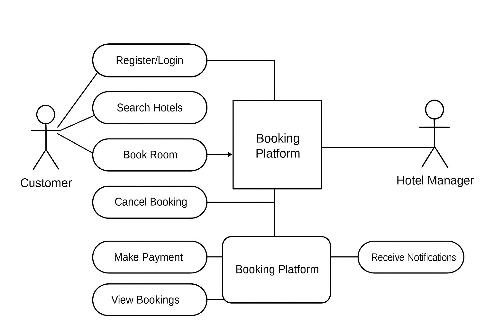

# Requirement Analysis in Software Development

## Introduction
This repository is created as part of the FeatureForge: Crafting Your Project Blueprint initiative under the ALX Software Engineering Program. It focuses on the **Requirement Analysis phase** of the Software Development Life Cycle (SDLC).

The goal of this repository is to demonstrate how requirements are gathered, documented, and validated before actual development begins. It highlights key aspects such as **functional and non-functional requirements**, **use case diagrams**, and **acceptance criteria** for a Booking Management System.

By completing this project, we gain hands-on experience in structuring project requirements, ensuring clear communication between stakeholders and developers, and setting a strong foundation for successful project delivery.

## 🧩 What is Requirement Analysis?

**Requirement Analysis** is a crucial stage in the **Software Development Life Cycle (SDLC)** that involves identifying, gathering, and analyzing the needs and expectations of stakeholders for a software system. It ensures that the development team fully understands what the client or end user wants before any design or coding begins.

## Why is Requirement Analysis Important?

Requirement Analysis is one of the most critical stages in the Software Development Life Cycle (SDLC) because it determines the success or failure of a project. A clear understanding of requirements ensures that developers build what users actually need, not what they assume.

Here are three key reasons why Requirement Analysis is important:

1. **Clarity and Shared Understanding**  
   Requirement Analysis ensures that all stakeholders — including clients, developers, and testers — have a common understanding of what the system should achieve. This minimizes confusion, prevents miscommunication, and aligns expectations.

2. **Reduced Development Costs and Rework**  
   By identifying and addressing unclear or incomplete requirements early, the team can avoid expensive changes during development or testing. Early detection of issues saves time, effort, and resources.

3. **Improved Product Quality and Customer Satisfaction**  
   A well-analyzed set of requirements ensures the system meets user needs, resulting in a high-quality product that performs as expected. This directly increases user satisfaction and trust in the software.

## Key Activities in Requirement Analysis

Requirement Analysis involves several structured activities to ensure that the software product meets stakeholder needs. These activities help transform vague ideas into well-defined, actionable requirements.

### The five key activities are:

- **Requirement Gathering**  
  This is the process of collecting information from stakeholders, users, and other sources to understand what the system should do. Techniques like interviews, surveys, and observation are commonly used.

- **Requirement Elicitation**  
  Involves engaging stakeholders to extract their needs and expectations. This step focuses on discovering hidden, implicit, or unclear requirements through brainstorming sessions, workshops, and use case studies.

- **Requirement Documentation**  
  All gathered and elicited requirements are recorded clearly in documents such as the Software Requirement Specification (SRS). This serves as a reference for developers, testers, and stakeholders throughout the project.

- **Requirement Analysis and Modeling**  
  In this stage, the collected requirements are analyzed for feasibility, consistency, and completeness. Modeling tools such as data flow diagrams, use case diagrams, or entity-relationship diagrams are used to represent requirements visually.

- **Requirement Validation**  
  The documented requirements are reviewed and validated with stakeholders to ensure they accurately represent user needs and business goals. Validation ensures that the right product will be built before development begins.

## Types of Requirements

In software engineering, system requirements are broadly classified into two main categories: **Functional Requirements** and **Non-functional Requirements**. Both are crucial in defining *what* a system should do and *how* it should perform.

---

### **1. Functional Requirements**

Functional requirements describe the **specific features, functions, and behaviors** that the system must perform. They define *what the system should do* to meet user and business needs.

#### **Examples for the Booking Management System:**

- **User Registration and Authentication:**  
  Users (customers and hotel managers) must be able to create accounts, log in securely, and manage their profiles.

- **Hotel Listing and Management:**  
  Hotel managers can add, edit, or remove property details such as room types, pricing, availability, and amenities.

- **Search and Filter Hotels:**  
  Customers can search hotels by city, date, price range, rating, or amenities.

- **Booking Management:**  
  Users can book available rooms, view booking history, and cancel or modify reservations.

- **Payment Integration:**  
  The system should integrate with secure payment gateways (e.g., PayPal, Stripe) for transactions.

- **Notifications:**  
  The system should send notifications to users and hotel managers for successful bookings, cancellations, and promotional offers.

- **View Bookings:**  
  Both customers and hotel managers can view current and past bookings, including payment and status details.

---

### **2. Non-functional Requirements**

Non-functional requirements define the **quality attributes** of the system — *how* the system performs rather than *what* it does. These ensure the software’s usability, performance, security, and scalability.

#### **Examples for the Booking Management System:**

- **Performance:**  
  The system should process a booking request within 2 seconds even under heavy traffic.

- **Scalability:**  
  The architecture should support thousands of concurrent users using a microservice-based design to handle load efficiently.

- **Security:**  
  All sensitive user data (passwords, payment info) must be encrypted. The system should comply with secure authentication protocols (e.g., OAuth2).

- **Availability:**  
  The application should maintain 99.9% uptime to ensure 24/7 accessibility for global users.

- **Data Consistency:**  
  Updates in hotel availability or booking records should reflect immediately across all connected services (e.g., Redis cache, Cassandra, ElasticSearch).

- **Maintainability:**  
  The system should use modular microservices, allowing independent updates or fixes without affecting the entire application.

- **Reliability:**  
  Data backup and recovery processes should ensure no loss of booking data during failures.

- **Usability:**  
  The platform should have an intuitive interface that allows users to book hotels in under three steps.

---

### Summary

| Requirement Type | Description | Example |
|------------------|-------------|----------|
| **Functional** | Defines what the system should do | User registration, search, booking, payments |
| **Non-functional** | Defines how the system should perform | Security, speed, scalability, uptime |

## Use Case Diagrams

### What is a Use Case Diagram?

A **Use Case Diagram** is a visual representation of how users (actors) interact with a system.  
It helps identify **who** uses the system and **what functions** they perform. In Requirement Analysis, use case diagrams are essential for clarifying system scope and communication between stakeholders, developers, and designers.

---

### Benefits of Use Case Diagrams

- **Clarifies System Scope:**  
  Clearly shows what functions are included or excluded from the system.

- **Improves Communication:**  
  Bridges understanding between technical teams and non-technical stakeholders.

- **Identifies User Interactions:**  
  Helps define system roles and how each user type interacts with the system.

- **Guides Development:**  
  Provides a blueprint for creating user stories, features, and test cases.

---

### Example: Use Case Diagram for Booking Management System

Below is a simplified use case diagram for a **Hotel Booking Management System**.  
It includes two main actors — **Customer** and **Hotel Manager** — and their interactions with the system.

#### **Actors**
- **Customer:** Registers, searches hotels, books rooms, and makes payments.  
- **Hotel Manager:** Manages hotel listings, updates availability, and views bookings.  
- **System (Booking Platform):** Handles notifications, payment processing, and record management.

### **Use Cases**
- User Registration and Login  
- Search Hotels  
- Book a Room  
- Make Payment  
- Cancel Booking  
- Manage Hotel Listings  
- View Bookings  
- Receive Notifications  

